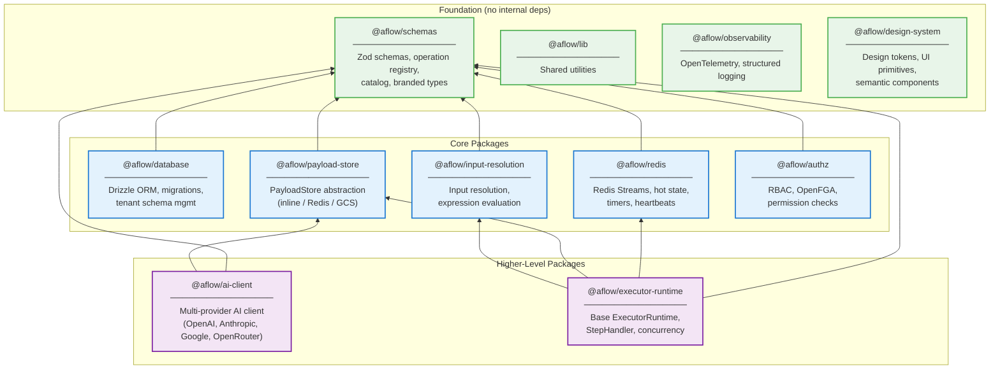
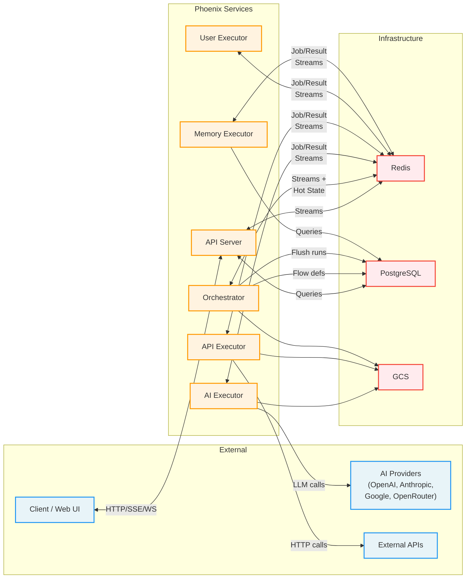

# Component & Dependency Diagram

Paste the Mermaid code below into [mermaid.live](https://mermaid.live) or any Mermaid-compatible renderer.

## Package Dependency Graph

## Apps and Their Dependencies

```mermaid
graph BT
  subgraph Packages["Packages"]
    schemas["schemas"]
    db["database"]
    redis["redis"]
    ps["payload-store"]
    ai["ai-client"]
    er["executor-runtime"]
    ir["input-resolution"]
    obs["observability"]
    lib["lib"]
    ds["design-system"]
  end

  subgraph Apps["Applications"]
    server["Server<br/>(Fastify API)<br/>port 3000"]
    orch["Orchestrator<br/>(FlowExecutionService)"]
    execAI["Executor: AI<br/>(generate, agent_turn,<br/>embed, image)"]
    execAPI["Executor: API<br/>(HTTP calls)"]
    execUser["Executor: User<br/>(input / approval)"]
    execMem["Executor: Memory<br/>(CRUD, vectors)"]
    execMock["Executor: Mock<br/>(dev only)"]
    web["Web App<br/>(Next.js 15)<br/>port 3001"]
    mcp["MCP Server<br/>(external agents)"]
  end

  %% Server deps
  server --> db
  server --> lib
  server --> obs
  server --> ps
  server --> redis
  server --> schemas

  %% Orchestrator deps
  orch --> db
  orch --> obs
  orch --> ps
  orch --> redis
  orch --> schemas

  %% Executor deps (common)
  execAI --> er
  execAI --> ai
  execAI --> lib
  execAI --> ps
  execAI --> redis
  execAI --> schemas

  execAPI --> er
  execAPI --> db
  execAPI --> lib
  execAPI --> ps
  execAPI --> redis
  execAPI --> schemas

  execUser --> er
  execUser --> lib
  execUser --> ps
  execUser --> redis
  execUser --> schemas

  execMem --> er
  execMem --> ai
  execMem --> db
  execMem --> lib
  execMem --> ps
  execMem --> redis
  execMem --> schemas

  execMock --> er
  execMock --> lib
  execMock --> ps
  execMock --> redis
  execMock --> schemas

  %% Web deps
  web --> ds
  web --> schemas

  %% MCP (no internal deps)

  %% Styling
  classDef app fill:#fff3e0,stroke:#FF9800,stroke-width:2px
  classDef pkg fill:#e3f2fd,stroke:#1976D2,stroke-width:2px

  class server,orch,execAI,execAPI,execUser,execMem,execMock,web,mcp app
  class schemas,db,redis,ps,ai,er,ir,obs,lib,ds pkg
```

## Service Communication Map

