# Data Flow & Storage Diagram

Paste the Mermaid code below into [mermaid.live](https://mermaid.live) or any Mermaid-compatible renderer.

## Where Data Lives: Redis vs Postgres vs PayloadStore

```mermaid
graph TB
  subgraph HotPath["Hot Path (Redis — real-time, ephemeral)"]
    direction TB
    RunState["Run Hot State<br/>aflow:run:{tenantId}:{runId}:state<br/>─────────────────<br/>status, currentStepId, runtimeState,<br/>startedAt, endedAt, retryCount<br/><i>Hash · TTL 24h</i>"]
    StepState["Step Hot State<br/>aflow:step:{tenantId}:{stepExecId}:state<br/>─────────────────<br/>status, operationId, inputRef, outputRef,<br/>startedAt, endedAt, attempt<br/><i>Hash · TTL 24h</i>"]
    RunEvents["Run Events<br/>aflow:run_events:{tenantId}:{runId}<br/>─────────────────<br/>FlowRunStarted, StepScheduled,<br/>StepStarted, StepCompleted,<br/>FlowRunSucceeded, FlowRunFailed, ...<br/><i>Stream · append-only</i>"]
  end

  subgraph Streams["Message Transport (Redis Streams — fire-and-forget)"]
    direction TB
    Control["aflow:control<br/>─────────────────<br/>start_run, resume_run, cancel_run<br/><i>Consumer group: orchestrator_control</i>"]
    Jobs["aflow:jobs:{stepType}<br/>─────────────────<br/>StepJobMessage per step type<br/>(ai, api, user, memory, ...)<br/><i>Consumer group: exec_{stepType}</i>"]
    Results["aflow:results<br/>─────────────────<br/>StepResultMessage<br/>(SUCCEEDED / FAILED / PAUSED)<br/><i>Consumer group: orchestrator</i>"]
  end

  subgraph Scheduling["Scheduling & Liveness (Redis)"]
    direction TB
    Timers["aflow:timers<br/>─────────────────<br/>Delayed step scheduling,<br/>retries, timeouts<br/><i>Sorted Set (score = timestamp)</i>"]
    Heartbeats["aflow:executor-heartbeat:{type}:{name}<br/>aflow:orchestrator:heartbeat<br/>─────────────────<br/>Liveness detection<br/><i>String · TTL 30s</i>"]
    DirtyRuns["aflow:dirty:runs<br/>─────────────────<br/>Runs needing Postgres flush<br/><i>Set</i>"]
  end

  subgraph DurablePath["Durable Path (PostgreSQL — source of record)"]
    direction TB
    FlowDefs["Flow Definitions<br/>─────────────────<br/>flowId, version, config,<br/>steps, edges, metadata"]
    RunHistory["Run History<br/>─────────────────<br/>runId, flowId, status,<br/>input/output refs, timestamps"]
    StepHistory["Step History<br/>─────────────────<br/>stepExecutionId, runId, operationId,<br/>status, input/output refs"]
    MemoryStore["Memory Store<br/>─────────────────<br/>key-value + vector embeddings,<br/>directories, metadata"]
    TenantConfig["Tenant Config<br/>─────────────────<br/>Schema-per-tenant isolation,<br/>tenant settings, API keys"]
  end

  subgraph PayloadStorage["Payload Storage (PayloadStore)"]
    direction TB
    InlineRef["Inline Refs<br/>─────────────────<br/>inline:&lt;base64-json&gt;<br/><i>For payloads &lt; 64KB</i>"]
    RedisPayload["Redis Payloads<br/>─────────────────<br/>redis://payload:{kind}:{id}<br/><i>Medium payloads, ephemeral</i>"]
    GCSPayload["GCS Payloads<br/>─────────────────<br/>gcs://bucket/path<br/><i>Large payloads, durable</i>"]

    PayloadKinds["Payload Kinds<br/>─────────────────<br/>input · output · error<br/>history · state · logs"]
  end

  %% Data flow arrows
  Control -->|"ControlConsumer<br/>reads"| RunState
  RunState -->|"FlowExecutionService<br/>schedules step"| Jobs
  Jobs -->|"Executor<br/>executes"| Results
  Results -->|"ResultConsumer →<br/>FlowExecutionService"| RunState

  RunState -.->|"atomicCreateRun()<br/>atomicScheduleStep()"| StepState
  RunState -.->|"appendRunEvent()"| RunEvents

  DirtyRuns -->|"ProjectionWorker"| RunHistory
  DirtyRuns -->|"ProjectionWorker"| StepHistory

  RunEvents -->|"readRunEvents()<br/>SSE to UI"| SSEEndpoint["GET /v1/runs/:runId/events<br/>(SSE)"]

  %% Styling
  classDef hot fill:#ffebee,stroke:#f44336,stroke-width:2px
  classDef stream fill:#fff3e0,stroke:#FF9800,stroke-width:2px
  classDef durable fill:#e3f2fd,stroke:#1565C0,stroke-width:2px
  classDef payload fill:#f1f8e9,stroke:#689F38,stroke-width:2px
  classDef scheduling fill:#fce4ec,stroke:#E91E63,stroke-width:2px

  class RunState,StepState,RunEvents hot
  class Control,Jobs,Results stream
  class FlowDefs,RunHistory,StepHistory,MemoryStore,TenantConfig durable
  class InlineRef,RedisPayload,GCSPayload,PayloadKinds payload
  class Timers,Heartbeats,DirtyRuns scheduling
```

## Payload Lifecycle

```mermaid
flowchart LR
  Input["Step Input<br/>(user data, previous output)"]
  Resolve["resolveStepInput()"]
  Store1["PayloadStore.store()"]
  RefDecision{{"Size?"}}
  Inline["inline:&lt;base64&gt;<br/>(< 64KB)"]
  Redis["redis://payload:...<br/>(medium, ephemeral)"]
  GCS["gcs://bucket/...<br/>(large, durable)"]
  PayloadRef["PayloadRef<br/>(opaque reference)"]
  JobMsg["StepJobMessage<br/>{ inputRef: PayloadRef }"]
  ExecResolve["PayloadStore.resolve()"]
  Data["Materialized Data"]
  Output["Step Output"]
  Store2["PayloadStore.store()"]
  OutputRef["outputRef: PayloadRef"]
  ResultMsg["StepResultMessage<br/>{ outputRef: PayloadRef }"]

  Input --> Resolve --> Store1 --> RefDecision
  RefDecision -->|"small"| Inline
  RefDecision -->|"medium"| Redis
  RefDecision -->|"large"| GCS
  Inline --> PayloadRef
  Redis --> PayloadRef
  GCS --> PayloadRef
  PayloadRef --> JobMsg --> ExecResolve --> Data
  Data -->|"execute"| Output --> Store2 --> OutputRef --> ResultMsg

  style RefDecision fill:#fff9c4,stroke:#F9A825
  style PayloadRef fill:#e8f5e9,stroke:#4CAF50,stroke-width:2px
  style OutputRef fill:#e8f5e9,stroke:#4CAF50,stroke-width:2px
```

## Write Ownership

| Data             | Writer                                           | Storage              | Notes                                      |
| ---------------- | ------------------------------------------------ | -------------------- | ------------------------------------------ |
| Run hot state    | FlowExecutionService (single writer)             | Redis Hash           | TTL 24h, flushed to Postgres on completion |
| Step hot state   | FlowExecutionService + Executor (status updates) | Redis Hash           | TTL 24h                                    |
| Run events       | FlowExecutionService + Executor                  | Redis Stream         | Append-only, read by SSE                   |
| Flow definitions | API Server (CRUD)                                | PostgreSQL           | Versioned                                  |
| Run/step history | ProjectionWorker                                 | PostgreSQL           | Eventual consistency from Redis            |
| Payloads         | Any service via PayloadStore                     | Inline / Redis / GCS | Immutable once stored                      |
| Memory entries   | Memory Executor                                  | PostgreSQL           | CRUD + vector search                       |
