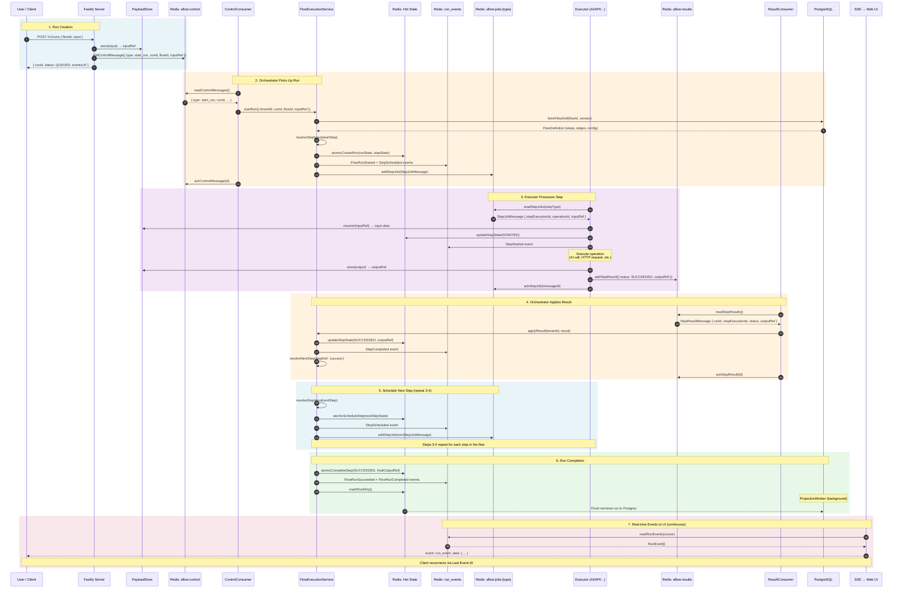
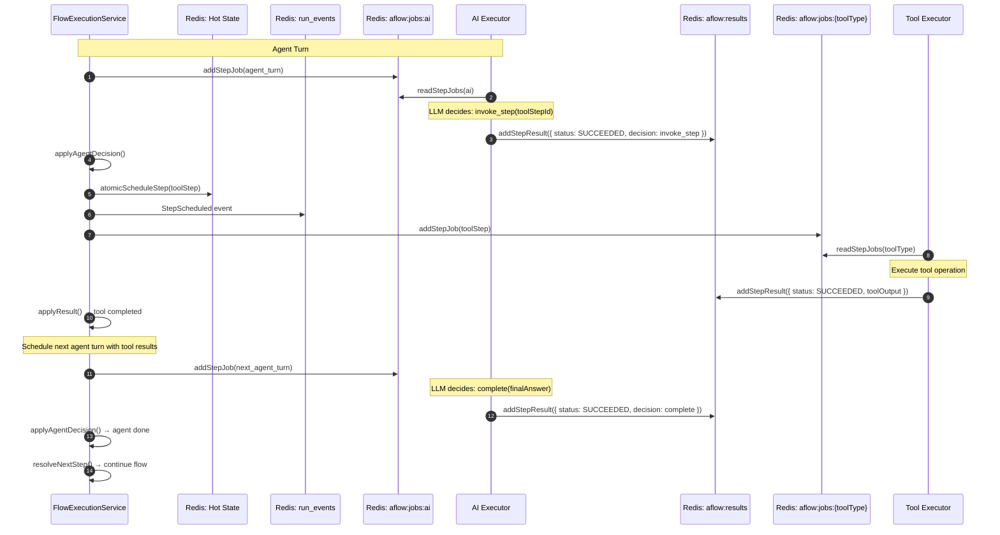

# Flow Execution Sequence Diagram

Paste the Mermaid code below into [mermaid.live](https://mermaid.live) or any Mermaid-compatible renderer.

## Full Flow Execution Lifecycle

## Agent Turn Sequence (when step is an AI agent)

