# System Architecture Diagram

Paste the Mermaid code below into [mermaid.live](https://mermaid.live) or any Mermaid-compatible renderer (GitHub, Notion, VS Code extension).

## High-Level Architecture

```mermaid
graph TB
  subgraph Clients["Clients"]
    WebUI["Web UI<br/>(Next.js 15 · port 3001)"]
    ExtAgent["External Agents<br/>(MCP clients)"]
    HTTPAPI["HTTP Clients<br/>(REST API)"]
  end

  subgraph API["API Layer"]
    Server["Fastify Server<br/>(REST + SSE + WebSocket · port 3000)"]
    MCP["MCP Server<br/>(Model Context Protocol)"]
  end

  subgraph Orchestration["Orchestration Layer"]
    Orchestrator["Flow Orchestrator"]
    ControlConsumer["ControlConsumer<br/>(start / resume / cancel)"]
    ResultConsumer["ResultConsumer<br/>(step results)"]
    FES["FlowExecutionService<br/>(single writer)"]
    TimerWorker["TimerWorker<br/>(retries / delays)"]
    FlushWorker["ProjectionWorker<br/>(Redis → Postgres)"]
  end

  subgraph Executors["Executor Layer (stateless workers)"]
    ExecAI["AI Executor<br/>(generate, agent_turn,<br/>embed, image)"]
    ExecAPI["API Executor<br/>(HTTP calls)"]
    ExecUser["User Executor<br/>(input / approval)"]
    ExecMemory["Memory Executor<br/>(CRUD, vector search)"]
    ExecMock["Mock Executor<br/>(dev only)"]
  end

  subgraph Infrastructure["Infrastructure"]
    subgraph RedisCluster["Redis (Memorystore / port 6379)"]
      ControlStream["aflow:control<br/>(control stream)"]
      JobStreams["aflow:jobs:{stepType}<br/>(job streams)"]
      ResultStream["aflow:results<br/>(result stream)"]
      EventStreams["aflow:run_events:{runId}<br/>(event streams)"]
      HotState["Run & Step Hot State<br/>(Hashes, TTL 24h)"]
      Timers["aflow:timers<br/>(ZSET)"]
      PubSub["aflow:pubsub:run:{runId}<br/>(SSE wakeup)"]
      Heartbeats["Executor & Orchestrator<br/>Heartbeats (TTL 30s)"]
    end

    subgraph Postgres["PostgreSQL (Cloud SQL / port 5433)"]
      TenantSchemas["Tenant Schemas<br/>(schema-per-tenant)"]
      Flows["Flow Definitions"]
      Runs["Run History<br/>(eventual consistency)"]
      Steps["Step History"]
      Memory["Memory Store"]
    end

    subgraph Storage["Object Storage"]
      GCS["Google Cloud Storage<br/>(large payloads)"]
      PayloadStore["PayloadStore<br/>(inline / Redis / GCS)"]
    end

    subgraph AIProviders["AI Providers"]
      OpenAI["OpenAI"]
      Anthropic["Anthropic"]
      Google["Google (Gemini)"]
      OpenRouter["OpenRouter"]
    end
  end

  %% Client connections
  WebUI -->|"HTTP + SSE"| Server
  ExtAgent -->|"MCP protocol"| MCP
  HTTPAPI -->|"REST API"| Server

  %% API to Redis
  Server -->|"addControlMessage()"| ControlStream
  Server -->|"readRunEvents()"| EventStreams
  Server -->|"subscribe"| PubSub
  MCP -->|"REST"| Server

  %% Orchestrator consumes
  ControlConsumer -->|"readControlMessages()"| ControlStream
  ResultConsumer -->|"readStepResults()"| ResultStream
  TimerWorker -->|"poll"| Timers

  %% Orchestrator internals
  ControlConsumer --> FES
  ResultConsumer --> FES
  TimerWorker --> FES

  %% Orchestrator writes
  FES -->|"atomicCreateRun()<br/>atomicScheduleStep()"| HotState
  FES -->|"appendRunEvent()"| EventStreams
  FES -->|"addStepJob()"| JobStreams
  FES -->|"publish"| PubSub
  FES -->|"markRunDirty()"| FlushWorker
  FlushWorker -->|"flush terminal runs"| Postgres

  %% Executors
  ExecAI -->|"readStepJobs()"| JobStreams
  ExecAPI -->|"readStepJobs()"| JobStreams
  ExecUser -->|"readStepJobs()"| JobStreams
  ExecMemory -->|"readStepJobs()"| JobStreams
  ExecMock -->|"readStepJobs()"| JobStreams

  ExecAI -->|"addStepResult()"| ResultStream
  ExecAPI -->|"addStepResult()"| ResultStream
  ExecUser -->|"addStepResult()"| ResultStream
  ExecMemory -->|"addStepResult()"| ResultStream
  ExecMock -->|"addStepResult()"| ResultStream

  %% Executor external calls
  ExecAI -->|"API calls"| AIProviders
  ExecAPI -->|"HTTP"| HTTPAPI
  ExecMemory -->|"queries"| Postgres

  %% Payload storage
  ExecAI --> PayloadStore
  ExecAPI --> PayloadStore
  ExecMemory --> PayloadStore
  FES --> PayloadStore
  PayloadStore --> GCS

  %% Heartbeats
  ExecAI -.->|"heartbeat"| Heartbeats
  ExecAPI -.->|"heartbeat"| Heartbeats
  ExecUser -.->|"heartbeat"| Heartbeats
  ExecMemory -.->|"heartbeat"| Heartbeats
  Orchestrator -.->|"heartbeat"| Heartbeats

  %% Styling
  classDef client fill:#e8f4f8,stroke:#2196F3,stroke-width:2px
  classDef api fill:#e8f5e9,stroke:#4CAF50,stroke-width:2px
  classDef orchestrator fill:#fff3e0,stroke:#FF9800,stroke-width:2px
  classDef executor fill:#f3e5f5,stroke:#9C27B0,stroke-width:2px
  classDef redis fill:#ffebee,stroke:#f44336,stroke-width:2px
  classDef postgres fill:#e3f2fd,stroke:#1565C0,stroke-width:2px
  classDef storage fill:#f1f8e9,stroke:#689F38,stroke-width:2px
  classDef ai fill:#fce4ec,stroke:#E91E63,stroke-width:2px

  class WebUI,ExtAgent,HTTPAPI client
  class Server,MCP api
  class Orchestrator,ControlConsumer,ResultConsumer,FES,TimerWorker,FlushWorker orchestrator
  class ExecAI,ExecAPI,ExecUser,ExecMemory,ExecMock executor
  class ControlStream,JobStreams,ResultStream,EventStreams,HotState,Timers,PubSub,Heartbeats redis
  class TenantSchemas,Flows,Runs,Steps,Memory postgres
  class GCS,PayloadStore storage
  class OpenAI,Anthropic,Google,OpenRouter ai
```

